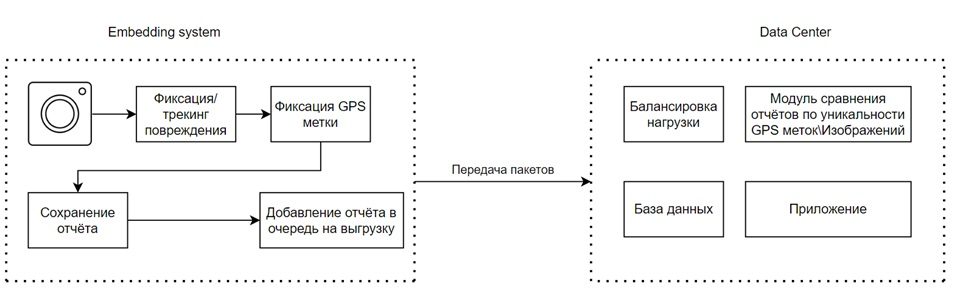

# AutoDefect
<h2>Стек технологий</h2>
Python, Kubernetes  

Позднее будут добавлены линтеры, типизация, деплой. Реализованы только коннекты с источниками данных 

<h2>Сборка Dockerfile локально</h2>
docker build -t images_autodefect_server_highload -f ..\Dockerfile_server_highload .  
docker run  -d --name container_autodefect_server_highload -p 3030:3030 images_autodefect_server_highload  

<h2>Сборка через Harbor (ci/cd gitlab) </h2>
build stage  
docker login -u ${REGISTRY_LOGIN} -p ${REGISTRY_PASSWORD} ${REGISTRY_URL}  
docker build -t ${DOCKER_IMAGE_NAME}:${SERVICE_VERSION} -f ..\Dockerfile_server_highload . --build-arg PORT_ID=${APP_PORT}  
docker tag ${DOCKER_IMAGE_NAME} ${REGISTRY_URL}/library/${DOCKER_IMAGE_NAME}:${SERVICE_VERSION}  
echo $DOCKER_AUTH > ~/.docker/config.json  
docker push ${REGISTRY_URL}/library/${DOCKER_IMAGE_NAME}:${SERVICE_VERSION}  
deploy stage  
docker login -u ${REGISTRY_LOGIN} -p ${REGISTRY_PASSWORD} ${REGISTRY_URL}  
docker pull ${REGISTRY_URL}/library/${DOCKER_IMAGE_NAME}:${SERVICE_VERSION}  
docker run  -d --name ${CONTAINER_NAME} -p ${APP_PORT}:${APP_PORT} ${DOCKER_IMAGE_NAME}:${SERVICE_VERSION}  

